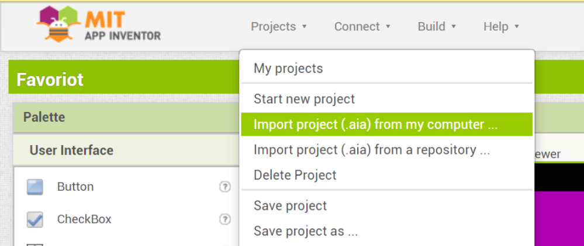
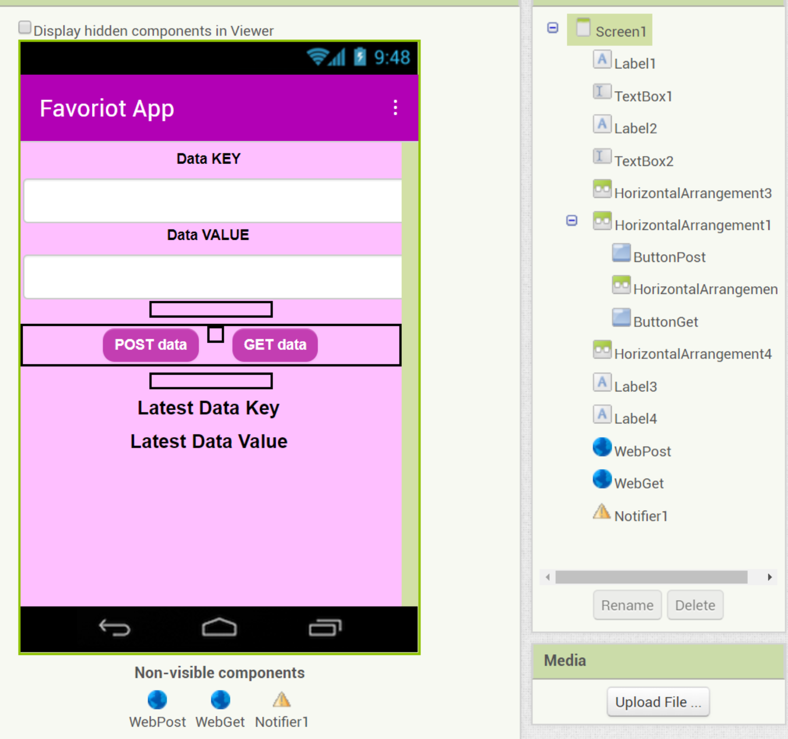
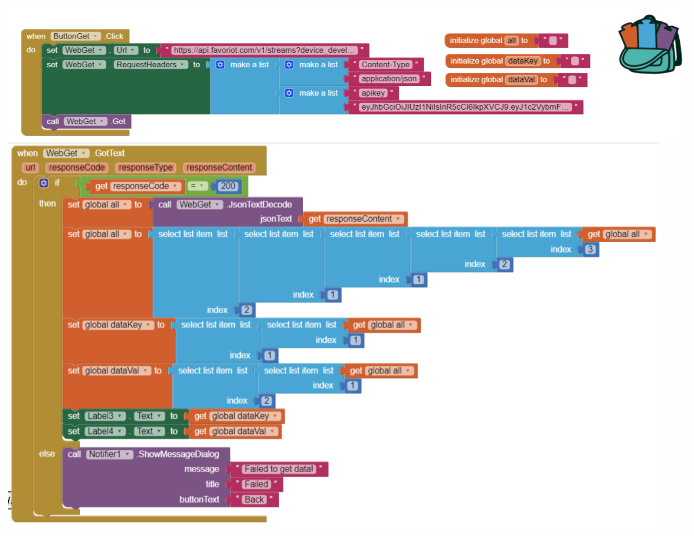
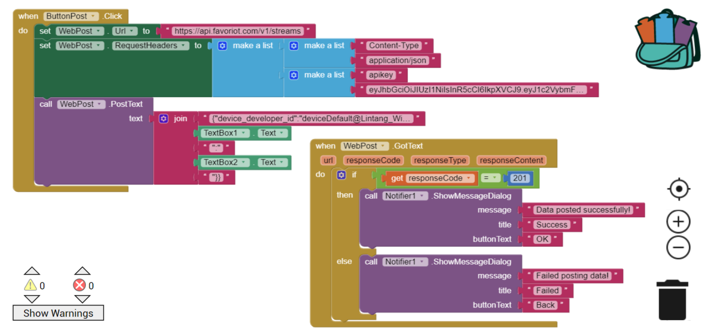

# Android MIT App Inventor & Favoriot API

[](https://www.youtube.com/watch?v=pFlpfQpe6vI)

1. This repo contains the App Inventor source of this project (__.aia__ file), simply download or clone this repo:

    ```bash
    $ git clone https://github.com/LintangWisesa/Android-App-Inventor_Favoriot-API.git
    ```

#

2. With your Google account, login to [__MIT App Inventor__](http://ai2.appinventor.mit.edu). Under __Projects__ menu, choose __Import project (.aia) from my computer__ then upload the __.aia__ file from this repo.

    

#

3. On its __Designer__ section, I use several components such as:
    - __Label__ (_User Interface_)
    - __Textbox__ (_User Interface_)
    - __Button__ (_User Interface_)
    - __Notifier__ (_User Interface_)
    - __Web__ (_Connectivity_)

    

#

4. Here is the block code for GET & POST button on __Blocks__ section:

    - __GET button__ block code:

    

    *__Notes:__*
   
    - Insert your Favoriot's __device developer ID__ & __account name__ to the URL: _https://api.favoriot.com/v1/streams?device_developer_id=yourDevice@yourAccount&max=1&order=DESC_.
   
    - Insert your Favoriot's __API Key__ into the request header.

    #

    - __POST button__ block code:

    

    *__Notes:__*
   
    - Set the URL to: _https://api.favoriot.com/v1/streams_.
   
    - Insert your Favoriot's __API Key__ into the request header.

#

5. Build the __.apk__ file. From __Build__ menu, choose one: __App (provide QR code for .apk)__ or __App (save .apk to my computer)__. Download & install it on your Android phone. Enjoy the app! 😎👌

#

#### Lintang Wisesa :love_letter: _lintangwisesa@ymail.com_

[Facebook](https://www.facebook.com/lintangbagus) | 
[Twitter](https://twitter.com/Lintang_Wisesa) |
[Google+](https://plus.google.com/u/0/+LintangWisesa1) |
[Youtube](https://www.youtube.com/user/lintangbagus) | 
:octocat: [GitHub](https://github.com/LintangWisesa) |
[Hackster](https://www.hackster.io/lintangwisesa)
